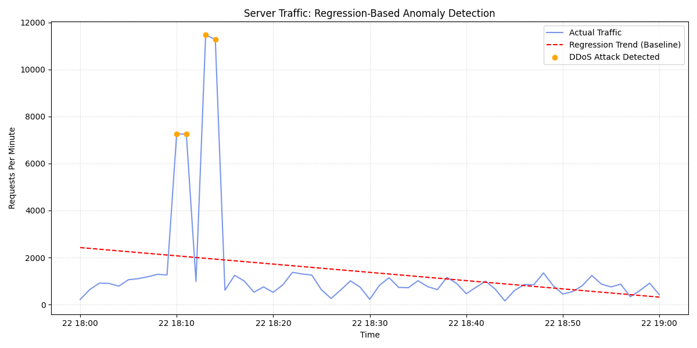
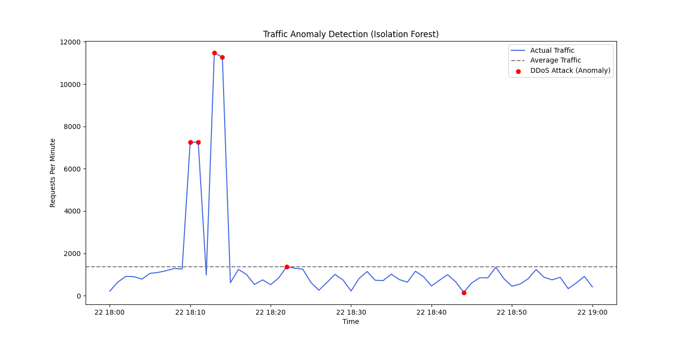

## DDoS Detection Analysis: Statistical Baseline vs. Machine Learning

### Introduction
This report details the identification of Distributed Denial of Service (DDoS) attacks using two distinct methodologies. By analyzing web server request frequency over time, we established a mathematical baseline using **Linear Regression** and then upgraded the detection capability using **Isolation Forest** unsupervised machine learning.

### Dataset and Resources
The analysis was performed on the following resources:
* **Log File:** [server.log](./server.log) (83k+ entries)
* **Regression Script:** [ddos_regression.py](./ddos_regression.py)
* **ML Script:** [ddos_isolation_forest.py](./ddos_isolation_forest.py)

---

### Methodology 1: Linear Regression (Statistical Baseline)
The initial analysis used Linear Regression to predict expected traffic trends. Any traffic exceeding this prediction by 2 standard deviations was flagged as a DDoS attack.

#### Phase A: Log Parsing (Regex)
Regular Expressions were used to isolate timestamps from the raw log format:
```python
# Extracting timestamps from the log format
match = re.search(r'\[(\d{4}-\d{2}-\d{2} \d{2}:\d{2}:\d{2})', line)
if match:
    log_data.append(match.group(1))
```
#### Phase B: Data Aggregation
Individual requests were resampled into 1-minute intervals to measure Requests Per Minute (RPM).

```python
# Grouping data into 1-minute windows
df_resampled = df.resample('1min', on='timestamp').count()
```
#### Phase C: Regression and Anomaly Detection
```python
# Linear Regression Model
X = np.arange(len(df_resampled)).reshape(-1, 1)
y = df_resampled['actual_count'].values
model = LinearRegression().fit(X, y)

# Detect anomalies (DDoS)
threshold = model.predict(X) + (2 * np.std(y))
ddos_events = df_resampled[df_resampled['actual_count'] > threshold]
```
Identified Intervals (Regression Results)

| Timestamp | Request Count (per min) | Status |
|---------|-------------------------|----------|
| 2024-03-22 18:10:00 | 7,263 |	Attack Detected |
| 2024-03-22 18:11:00 | 7,245 |	Attack Detected |
| 2024-03-22 18:13:00 | 11,468| Peak Attack |
| 2024-03-22 18:14:00 | 11,279| Peak Attack |

#### Visualization (Regression)



---

### Methodology 2: Isolation Forest (Machine Learning)
The analysis was upgraded to an Isolation Forest model to detect anomalies based on data density rather than a global linear trend.

#### Phase D: ML Anomaly Detection

```python
# Isolation Forest Model
X = df_resampled[['actual_count']].values
model = IsolationForest(n_estimators=100, contamination=0.1, random_state=42)
df_resampled['anomaly'] = model.fit_predict(X)
df_resampled['is_ddos'] = df_resampled['anomaly'] == -1
```
#### Identified Intervals (Isolation Forest Results)
The ML model identified the peak attacks and surfaced additional sub-threshold anomalies:

| Timestamp | Request Count (per min) | Status |
|---------|-------------------------|----------|
| 2024-03-22 18:10:00 | 7,263 |	Attack Detected |
| 2024-03-22 18:11:00 | 7,245 |	Attack Detected |
| 2024-03-22 18:13:00 | 11,468| Peak Attack |
| 2024-03-22 18:14:00 | 11,279| Peak Attack |
| 2024-03-22 18:22:00 | 1,371 | New Anomaly Detected |
| 2024-03-22 18:44:00 | 155 | New Anomaly Detected |

#### Visualization (Isolation Forest)



---

### Comparative Analysis: The "1371" and "155" Findings

A critical takeaway of this project is why the Isolation Forest detected more anomalies than the Regression model:

* **Statistical Limitation:**  In the Regression model, the massive 11,000 RPM peaks inflated the global standard deviation. Because of this, the interval at 1,371 RPM was considered "statistically normal" and ignored.
* **ML Precision:** The Isolation Forest identifies points that are "isolated" from the dense cluster of normal traffic (20-50 RPM). It correctly identified 1,371 and 155 as anomalies because they exist in a "low-density" space, providing a more sensitive detection mechanism for non-linear attacks.

### Conclusion
The analysis successfully isolated the DDoS attack. While Linear Regression provides a solid baseline for identifying massive traffic spikes, the Isolation Forest proved superior in identifying subtle, sub-threshold anomalies that could represent reconnaissance or multi-stage attack patterns.